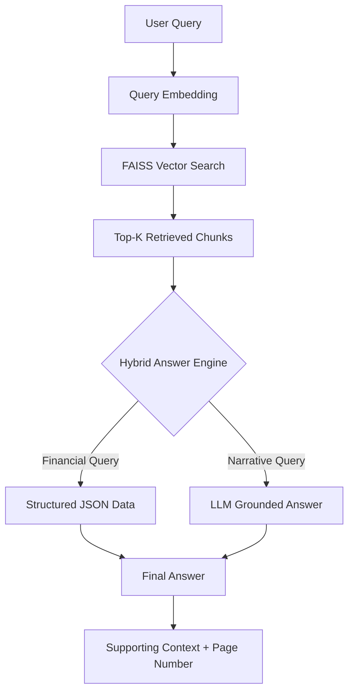

---

# Swiggy Annual Report AI Assistant (RAG System)


---

# Overview

This project implements a **Retrieval-Augmented Generation (RAG) system** that answers questions strictly using the **Swiggy Annual Report FY 2023–24**.

The system combines **semantic retrieval**, **structured financial extraction**, and **LLM-based reasoning** to generate **accurate, grounded answers** while preventing hallucinations.

Unlike typical RAG prototypes, this system includes:

* Deterministic financial metric extraction
* Semantic vector search using FAISS
* Local LLM inference
* Hallucination prevention mechanisms
* Explainable answers with document context
* Automated evaluation framework
* Interactive Streamlit interface

The result is a **reliable AI assistant for financial document analysis**.

---

# Problem Statement

Annual reports contain large volumes of financial and governance information.
Manually searching these long documents is inefficient and time-consuming.

The goal of this project is to build a **document-grounded AI system** that:

* Accepts natural language questions
* Retrieves relevant sections from the report
* Generates answers strictly from the document
* Prevents hallucinations
* Provides supporting context and page references

---

# System Architecture

The system follows a **hybrid RAG architecture**.

```
User Query
     ↓
Query Embedding
     ↓
Vector Search (FAISS)
     ↓
Top-K Relevant Chunks
     ↓
Hybrid Answer Engine
     ├── Structured Financial Lookup
     └── LLM Grounded Generation
     ↓
Final Answer + Supporting Context
```

---

# Architecture Diagram



---

# Key Features

## Hybrid Structured + RAG Architecture

Financial metrics are parsed during document ingestion and stored in **structured JSON format**.

This ensures:

* Deterministic financial answers
* No numeric hallucination
* Accurate year-specific queries

Example:

```
Question:
What was the net loss after tax in FY24?

Answer:
The standalone net loss after tax in FY24 was (18,880).
```

---

## Semantic Document Retrieval

Document chunks are embedded using:

```
sentence-transformers/all-mpnet-base-v2
```

Embeddings are indexed with **FAISS** to enable fast semantic similarity search.

For each query, the system retrieves **Top-K relevant chunks** before generating an answer.

---

## Hallucination Prevention

The system uses multiple safeguards to prevent hallucination:

1. Similarity threshold filtering
2. Strict grounding prompts
3. Structured financial extraction
4. Explicit refusal for unsupported queries

Example:

```
Question:
Who is the CEO of Zomato?

Answer:
The information is not available in the Swiggy Annual Report.
```

---

## Explainable Answers

Each answer includes:

* Source page number
* Similarity score
* Supporting excerpt from the document

This ensures **transparency and verifiability**.

---

# Project Structure

```
swiggy_rag/
│
├── data/
│   └── swiggy_annual_report.pdf
│
├── ingestion/
│   ├── pdf_loader.py
│   ├── chunking.py
│   └── financial_parser.py
│
├── embeddings/
│   ├── embedder.py
│   └── vector_store.py
│
├── rag/
│   ├── retriever.py
│   └── generator.py
│
├── evaluation/
│   ├── test_questions.py
│   └── evaluator.py
│
├── app/
│   └── streamlit_app.py
│
├── build_index.py
├── financial_data.json
├── vector_store.pkl
├── requirements.txt
└── README.md
```

---

# Technology Stack

| Component       | Technology                    |
| --------------- | ----------------------------- |
| Language        | Python                        |
| Vector Database | FAISS                         |
| Embedding Model | Sentence Transformers (MPNet) |
| LLM             | Google FLAN-T5                |
| PDF Processing  | PyMuPDF                       |
| UI Framework    | Streamlit                     |

---

# Design Decisions

## Chunk Size

```
500–800 tokens
```

Chosen to balance:

* semantic coherence
* embedding quality
* retrieval accuracy

---

## Chunk Overlap

```
100–150 tokens
```

Overlap preserves context across chunk boundaries.

---

## Embedding Model

```
all-mpnet-base-v2
```

Chosen because it:

* produces high-quality sentence embeddings
* performs strongly on semantic similarity tasks
* runs efficiently on CPU environments

---

## Vector Search

FAISS with **cosine similarity** is used to enable fast and scalable semantic retrieval.

---

## Hybrid Financial Reasoning

Financial tables are parsed during ingestion and stored in structured JSON.

Example:

```json
{
  "standalone": {
    "net_loss_after_tax": {
      "FY24": "18,880",
      "FY23": "37,576"
    }
  }
}
```

This prevents LLM numeric hallucination and improves reliability.

---

# Evaluation

An automated evaluation suite validates system performance using benchmark queries.

Test categories include:

* Financial metrics
* Governance information
* Operational metrics
* Hallucination refusal

Run evaluation:

```
python evaluation/evaluator.py
```

Example result:

```
Final Accuracy: 9/9 = 100%
```

---

# Running the System

## 1 Install Dependencies

```
pip install -r requirements.txt
```

---

## 2 Build the Vector Index

```
python build_index.py
```

This step performs:

* PDF parsing
* document chunking
* embedding generation
* FAISS index creation
* financial data extraction

---

## 3 Run CLI Question Answering

```
python test_rag.py
```

---

## 4 Launch Web Interface

```
python -m streamlit run app/streamlit_app.py
```

Open the application at:

```
http://localhost:8501
```

---

# Example Queries

### Financial

```
What was the standalone net loss after tax in FY24?
What were the consolidated total expenses in FY24?
What was the earnings per share in FY23?
```

### Governance

```
How many board meetings were held?
Who is the Managing Director and Group CEO?
```

### Operations

```
How many cities does Swiggy operate in?
```

### Hallucination Test

```
Who is the CEO of Zomato?
```

---

# Future Improvements

Possible extensions include:

* Cross-encoder re-ranking
* Query logging and analytics
* Multi-document RAG support
* Docker-based deployment
* GPU acceleration
* stronger open-source LLMs

---

# Conclusion

This project demonstrates how **Retrieval-Augmented Generation can be applied to financial documents** to build reliable AI assistants.

By combining:

* structured financial parsing
* semantic retrieval
* grounded LLM reasoning

the system delivers **accurate, explainable, and hallucination-resistant answers** for complex financial reports.

---

# Author

Harsh G. Sharma
B.Tech Computer Science
VJTI Mumbai

---
.
